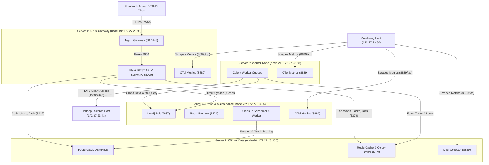

# LinkX Master API & System Endpoint Documentation

**Document Version**: 2.0  
**Target Audience**: Project Owners, System Architects, API Integration Teams, Security & Ops Teams  
**Last Updated**: August 2026  

---

## 1. System Architecture & Topology Overview

The LinkX backend architecture is designed as a distributed, split 4-server infrastructure connected over a private subnet (`172.27.23.0/24`). Heavy data analysis, ingestion, worker processing, and graph database storage are decoupled from the core API gateway to ensure maximum responsiveness and scalability.

### Architecture Topology Diagram



---

## 2. Master Endpoint Catalog Table

Below is the complete catalog of all API endpoints, real-time WebSocket events, database interfaces, and monitoring endpoints across all servers.

| Component / Server | Endpoint / Port | Method / Protocol | Nature | Auth / Security | Description & Purpose |
| :--- | :--- | :---: | :---: | :--- | :--- |
| **Server 1** (API & Gateway) | `/auth/login` | `POST` | **External** | Public | Human user login with `username` and `password`. Returns JWT token. |
| **Server 1** (API & Gateway) | `/auth/sso/exchange` | `POST` | **External** | Public (PKCE) | Exchange parent SSO code + PKCE for LinkX JWT bearer token. |
| **Server 1** (API & Gateway) | `/auth/service-token` | `POST` | **External** | Service Credentials | Issue JWT to sibling microservices via `client_id` and `client_secret`. |
| **Server 1** (API & Gateway) | `/auth/parent-token` | `POST` | **Internal / Trusted** | `X-Linkx-Parent-Secret` / CTMS JWT | Exchange verified parent identity or CTMS ES256 token for LinkX JWT. |
| **Server 1** (API & Gateway) | `/auth/me` | `GET` | **External** | Bearer Token | Fetch current authenticated actor details, roles, and permissions. |
| **Server 1** (API & Gateway) | `/auth/verify` | `POST` | **External** | Bearer Token | Verify JWT token validity and retrieve actor context. |
| **Server 1** (API & Gateway) | `/auth/logout` | `POST` | **External** | Bearer Token | Revoke active JWT session token on backend. |
| **Server 1** (API & Gateway) | `/auth/lock` | `POST` | **External** | Bearer Token | Enforce backend-backed session lock state. |
| **Server 1** (API & Gateway) | `/auth/unlock` | `POST` | **External** | Bearer Token | Unlock active session after password re-verification. |
| **Server 1** (API & Gateway) | `/auth/idle-timeout` | `POST` | **External** | Bearer Token | Execute session cleanup upon reaching maximum idle timeout limit. |
| **Server 1** (API & Gateway) | `/auth/session-policy` | `GET`, `PATCH` | **External** | Bearer Token | Retrieve or update frontend idle locking policy configuration. |
| **Server 1** (API & Gateway) | `/auth/preferences` | `GET`, `PATCH` | **External** | Bearer Token | Retrieve or update individual user preference settings. |
| **Server 1** (API & Gateway) | `/auth/admin/users` | `GET`, `POST` | **External** | Bearer (`users:manage`) | List or create platform user accounts (`admin`/`superuser`). |
| **Server 1** (API & Gateway) | `/auth/admin/users/<id>` | `PATCH`, `DELETE` | **External** | Bearer (`users:manage`) | Update user roles/status or delete user account. |
| **Server 1** (API & Gateway) | `/auth/admin/service-accounts` | `GET`, `POST` | **External** | Bearer (`users:manage`) | List or create service accounts for sibling microservices. |
| **Server 1** (API & Gateway) | `/auth/admin/service-accounts/<id>` | `PATCH`, `DELETE` | **External** | Bearer (`users:manage`) | Update service account permissions, rotate secrets, or delete. |
| **Server 1** (API & Gateway) | `/auth/admin/audit/security` | `GET` | **External** | Bearer (Admin) | Retrieve system security audit log records. |
| **Server 1** (API & Gateway) | `/api/STR_link_analysis` | `POST` | **External / Public** | Optional `X-API-Key` | Public Suspicious Transaction Report (STR) link analysis lookup. |
| **Server 1** (API & Gateway) | `/api/ML_link_analysis` | `POST` | **External** | Bearer Token | Run machine-learning assisted link analysis pipeline. |
| **Server 1** (API & Gateway) | `/api/ml_service/link_analysis` | `POST` | **External** | Bearer Token | Alias endpoint for ML link analysis pipeline. |
| **Server 1** (API & Gateway) | `/init` | `POST` | **External** | Bearer Token | Initialize analysis workspace session and obtain `session_id`. |
| **Server 1** (API & Gateway) | `/account/configuration` | `GET`, `POST` | **External** | Bearer Token | Read or update account-level system settings. |
| **Server 1** (API & Gateway) | `/configuration` | `POST` | **External** | Bearer Token | Save workspace/session configuration state. |
| **Server 1** (API & Gateway) | `/workspace/layout` | `GET`, `PUT` | **External** | Bearer Token | Retrieve or update user frontend graph layout parameters. |
| **Server 1** (API & Gateway) | `/init_source` | `POST` | **External** | Bearer (`source:create`) | Initialize a new data source connection context. |
| **Server 1** (API & Gateway) | `/connect_to_source` | `POST` | **External** | Bearer (`source:connect`) | Connect data source to active analysis session. |
| **Server 1** (API & Gateway) | `/disconnect_source` | `POST` | **External** | Bearer (`source:disconnect`) | Disconnect data source from session workspace. |
| **Server 1** (API & Gateway) | `/connect_to_tool` | `POST` | **External** | Bearer (`graph:read`) | Connect to Neo4j database tool & persist session credentials. |
| **Server 1** (API & Gateway) | `/disconnect_tool` | `POST` | **External** | Bearer (`graph:read`) | Disconnect from active Neo4j graph instance. |
| **Server 1** (API & Gateway) | `/close_source_window` | `POST` | **External** | Bearer Token | Close active data source view handle. |
| **Server 1** (API & Gateway) | `/upload_batch_files` | `POST` | **External** | Bearer (`batch:upload`) | Upload batch raw data files for ingestion. |
| **Server 1** (API & Gateway) | `/live_batch_files` | `POST` | **External** | Bearer (`batch:upload`) | Stream live entity batch file data into session graph. |
| **Server 1** (API & Gateway) | `/graph_link` | `POST` | **External** | Bearer (`graph:link`) | Execute entity relationship linking algorithms. |
| **Server 1** (API & Gateway) | `/get_graph` | `POST` | **External** | Bearer (`graph:read`) | Request graph fetch; queues async worker job and returns `job_id`. |
| **Server 1** (API & Gateway) | `/jobs/<job_id>` | `GET` | **External** | Bearer Token | Check status and fetch result of async background job. |
| **Server 1** (API & Gateway) | `/ai/health` | `GET` | **External** | Bearer (`reports:read`) | AI integration service health check. |
| **Server 1** (API & Gateway) | `/ai/sessions` | `GET` | **External** | Bearer (`reports:read`) | List active AI co-analyst sessions. |
| **Server 1** (API & Gateway) | `/ai/sessions/<session_id>` | `GET` | **External** | Bearer (`reports:read`) | Retrieve AI session details. |
| **Server 1** (API & Gateway) | `/ai/sessions/<session_id>/artifacts` | `GET` | **External** | Bearer (`reports:read`) | List generated report artifacts for an AI session. |
| **Server 1** (API & Gateway) | `/ai/cleanup-runs` | `GET` | **External** | Bearer (`reports:read`) | Retrieve AI cleanup and audit execution logs. |
| **Server 1** (API & Gateway) | `/ai/sessions/<session_id>/graph/metadata` | `GET` | **External** | Bearer (`reports:read`) | Fetch graph summary metadata for AI session from Neo4j. |
| **Server 1** (API & Gateway) | `/admin/audit/cleanup` | `GET` | **External** | Bearer (Admin) | Retrieve session cleanup audit history. |
| **Server 1** (API & Gateway) | `/admin/cleanup/session` | `POST` | **External** | Bearer (Admin) | Manually trigger immediate workspace session cleanup. |
| **Server 1** (API & Gateway) | `/db/health` | `GET` | **External / Public** | Public | Probes PostgreSQL database connectivity. |
| **Server 1** (API & Gateway) | `/metrics` / Port `8889` | `GET` | **Internal** | UFW (`172.27.23.36`) | Exposes OpenTelemetry / Prometheus metrics. |
| **Server 1** (Socket.IO Gateway) | `/socket.io/` (`connect`) | WebSocket | **External** | `auth.token` payload | Authenticates and establishes Socket.IO real-time channel. |
| **Server 1** (Socket.IO Gateway) | `notification_subscribe` | WebSocket | **External** | Authenticated Socket | Subscribe to user notification stream. |
| **Server 1** (Socket.IO Gateway) | `notification_unsubscribe` | WebSocket | **External** | Authenticated Socket | Unsubscribe from notification stream. |
| **Server 1** (Socket.IO Gateway) | `str_report_register_receiver` | WebSocket | **External** | Authenticated Socket | Register receiver for live STR report updates. |
| **Server 1** (Socket.IO Gateway) | `log_stream_plug` | WebSocket | **External** | Authenticated Socket | Plug into real-time server log stream. |
| **Server 1** (Socket.IO Gateway) | `log_stream_unplug` | WebSocket | **External** | Authenticated Socket | Unplug from real-time server log stream. |
| **Server 1** (Socket.IO Gateway) | `graph_status_subscribe` | WebSocket | **External** | Authenticated Socket | Subscribe to real-time graph job execution status updates. |
| **Server 1** (Socket.IO Gateway) | `graph_status_unsubscribe` | WebSocket | **External** | Authenticated Socket | Unsubscribe from graph status updates. |
| **Server 2** (Control Data Host) | PostgreSQL (`:5432`) | TCP | **Internal** | PostgreSQL User/Pass | Central DB for users, RBAC, SSO hashes, session configs. |
| **Server 2** (Control Data Host) | Redis (`:6379`) | TCP | **Internal** | `REDIS_PASSWORD` | Session cache, key-value store, and Celery broker. |
| **Server 2** (Control Data Host) | OTel Collector (`:8889`) | TCP | **Internal** | UFW (`172.27.23.36`) | Exposes Control Data host metrics to Prometheus scraper. |
| **Server 3** (Worker Host) | Celery Worker Queue | Internal Broker | **Internal** | Task Queue Claims | Processes `graph_fetch` jobs, strict/fuzzy search, Spark parquet dataframe merges. |
| **Server 3** (Worker Host) | OTel Metrics (`:8889`) | TCP | **Internal** | UFW (`172.27.23.36`) | Exposes Worker queue performance metrics. |
| **Server 4** (Graph & Maintenance) | Neo4j Bolt (`:7687`) | TCP | **Internal** | Neo4j Auth | High-performance graph DB protocol for Cypher queries. |
| **Server 4** (Graph & Maintenance) | Neo4j Browser (`:7474`) | HTTP | **Internal / Admin** | Neo4j Admin Auth | Web management console for Neo4j administrators. |
| **Server 4** (Graph & Maintenance) | Cleanup Services | Systemd | **Internal** | Local Services | Systemd background units for expired session/graph pruning. |
| **Server 4** (Graph & Maintenance) | OTel Metrics (`:8889`) | TCP | **Internal** | UFW (`172.27.23.36`) | Exposes Neo4j database metrics to Prometheus. |
| **Monitoring Host** (`172.27.23.36`)| Prometheus Scraper (`:8889`)| TCP | **Internal** | Monitoring Network | Scrapes metrics across Servers 1–4 every 15–60 seconds. |
| **Hadoop/Search Host** (`172.27.23.43`)| WebHDFS (`:9870`)/RPC (`:9000`) | HTTP/TCP | **Internal** | Internal Network | Big data storage cluster for HDFS filesystem operations and data ingestion (`:5000`). |

---

## 3. Detailed Functional API Documentation

### 3.1 Authentication & Identity Management

#### 1. Human Login (`POST /auth/login`)
- **Headers**: `Content-Type: application/json`
- **Request Body**:
  ```json
  {
    "username": "analyst1",
    "password": "<secure-password>"
  }
  ```
- **Response** (`200 OK`):
  ```json
  {
    "message": "success!",
    "token": "eyJhbGciOiJIUzI1NiIsInR5cCI6IkpXVCJ9...",
    "actor": {
      "id": 1,
      "actor_type": "user",
      "username": "analyst1",
      "display_name": "Analyst One",
      "roles": ["analyst"],
      "permissions": ["session:create", "graph:read", "graph:link"]
    }
  }
  ```

#### 2. Parent SSO Exchange (`POST /auth/sso/exchange`)
- **Purpose**: One-time authorization code exchange for PKCE authorization flows.
- **Request Body**:
  ```json
  {
    "code": "sso_code_abc123",
    "state": "csrf_state_xyz",
    "client": "linkx_frontend",
    "redirect_uri": "https://linkx.example.com/callback"
  }
  ```
- **Response** (`200 OK`):
  ```json
  {
    "message": "success!",
    "token": "<linkx_user_jwt>",
    "user": {
      "id": 10,
      "username": "john.doe",
      "roles": ["analyst"],
      "permissions": ["session:create", "graph:read"]
    }
  }
  ```

#### 3. Parent Token Exchange (`POST /auth/parent-token`)
- **Purpose**: Exchange trusted parent project identity or CTMS ES256 token for a LinkX JWT.
- **Headers**:
  ```http
  Content-Type: application/json
  X-Linkx-Parent-Secret: <LINKX_PARENT_SHARED_SECRET>
  ```
- **Request Body (Legacy HMAC Mode)**:
  ```json
  {
    "username": "team_lead@example.com",
    "display_name": "Team Lead",
    "roles": ["team_leader"]
  }
  ```
- **Request Body (CTMS ES256 Mode)**:
  ```json
  {
    "access_token": "eyJhbGciOiJFUzI1NiIs..."
  }
  ```
- **Response** (`200 OK`):
  ```json
  {
    "message": "success!",
    "token": "<linkx_user_jwt>",
    "actor": {
      "actor_type": "user",
      "username": "team_lead@example.com",
      "roles": ["admin"],
      "permissions": ["users:manage", "graph:read"]
    }
  }
  ```

---

### 3.2 Workspace & Graph Analysis APIs

#### 1. Initialize Workspace (`POST /init`)
- **Headers**: `Authorization: Bearer <jwt_token>`
- **Request Body**:
  ```json
  {
    "id": "init",
    "existing_session": "optional_previous_session_id"
  }
  ```
- **Response** (`200 OK`):
  ```json
  {
    "results": "499767",
    "configurations": {},
    "message": "success!"
  }
  ```
  > [!NOTE]
  > The `results` field in the response represents the unique LinkX `session_id`. Store this `session_id` for subsequent graph queries.

#### 2. Connect to Neo4j Tool (`POST /connect_to_tool`)
- **Headers**: `Authorization: Bearer <jwt_token>`
- **Request Body**:
  ```json
  {
    "session_id": "499767",
    "uri": "bolt://172.27.23.85:7687",
    "auth": ["neo4j", "<neo4j-password>"]
  }
  ```
- **Response** (`200 OK`):
  ```json
  {
    "message": "connected successfully",
    "session_id": "499767"
  }
  ```

#### 3. Request Graph Fetch (`POST /get_graph`)
- **Headers**: `Authorization: Bearer <jwt_token>`
- **Behavior**: Enqueues an asynchronous `graph_fetch` job on the Server 3 worker queue.
- **Request Body**:
  ```json
  {
    "session_id": "499767",
    "node_type": "account",
    "depth": 2
  }
  ```
- **Response** (`202 Accepted`):
  ```json
  {
    "status": "queued",
    "job_id": "job-worker-89412a",
    "poll_url": "/jobs/job-worker-89412a"
  }
  ```

#### 4. Poll Async Job Status (`GET /jobs/<job_id>`)
- **Headers**: `Authorization: Bearer <jwt_token>`
- **Response** (`200 OK`):
  ```json
  {
    "job_id": "job-worker-89412a",
    "status": "completed",
    "result": {
      "nodes": 120,
      "edges": 340,
      "dataframe_path": "/opt/linkx-worker/artifacts/499767_graph.parquet"
    }
  }
  ```

---

### 3.3 Public STR & ML Link Analysis APIs

#### 1. Public STR Link Analysis (`POST /api/STR_link_analysis`)
- **Headers**: `X-API-Key: <LINKX_PUBLIC_API_KEY>` (if key protection is enabled)
- **Request Body**:
  ```json
  {
    "entity": "bank",
    "type": "account_number",
    "value": "5642153",
    "session_id": "str_workspace_1"
  }
  ```
- **Response** (`200 OK`):
  ```json
  {
    "message": "success!",
    "session_id": "str_workspace_1",
    "wait_for_prepare": false,
    "socket_emit": []
  }
  ```

---

### 3.4 AI Co-Analyst APIs (`/ai/*`)

- **GET `/ai/health`**: Returns AI service availability.
- **GET `/ai/sessions`**: Returns active AI investigation sessions.
- **GET `/ai/sessions/<session_id>/artifacts`**: Returns generated markdown, visual, and graph artifacts for a given session.
- **GET `/ai/sessions/<session_id>/graph/metadata`**: Queries Neo4j for node/relationship counts and graph metadata associated with an AI investigation.

---

## 4. Role & Permission Matrix

The system enforces strict Role-Based Access Control (RBAC). Roles mapped from parent systems receive standard permission sets:

### Role Mapping Reference

| Parent System Role | LinkX Role | Permission Scope |
| :--- | :--- | :--- |
| `superuser` / `SUPER_ADMIN` | `top-level operator` | Full system access (`*`), user management, secret management. |
| `team_leader` | `admin` | User management (`analyst`/`viewer` accounts), security audit logs, full graph & session access. |
| `analyst` | `analyst` | Create sessions, connect data sources, upload batch files, graph linking & queries. |
| `viewer` | `viewer` | Read-only graph query access (`graph:read`, `reports:read`). |

### Standard Granular Permissions

```text
auth:verify       - Verify JWT tokens
session:create    - Initialize new workspace sessions
session:read      - Read active workspace session state
config:read       - Read account/system configurations
config:write      - Modify configuration settings
source:create     - Provision data sources
source:connect    - Bind data source to session
source:disconnect - Unbind data source from session
graph:create      - Create graph structures
graph:read        - Read graph node & edge data
graph:link        - Perform entity linking algorithms
batch:upload      - Upload batch ingestion files
batch:query       - Query batch data pipelines
analysis:run      - Execute STR/ML analysis pipelines
reports:read      - Access AI & analysis report artifacts
users:manage      - Create, update, or delete platform users & service accounts
```

---

## 5. Security & Gateway Protocol Rules

> [!IMPORTANT]
> **API Gateway Guidelines**:
> 1. All external client calls MUST go through the Gateway (`http://172.27.23.95:8000` or Nginx `80`/`443`). Direct access to internal ports (`5432`, `6379`, `7687`) is blocked by UFW firewall rules.
> 2. JWT Tokens MUST be passed in the HTTP Authorization header: `Authorization: Bearer <jwt_token>`.
> 3. Do not confuse `auth_token` (identifies caller identity) with LinkX `session_id` (identifies workspace state).
> 4. Redis requires mandatory authentication password (`REDIS_PASSWORD`).
> 5. OpenTelemetry metrics on port `8889` are strictly restricted to the Monitoring host (`172.27.23.36`).

---

## 6. Required Environment Variables for Integration

The following environment variables should be set across client, parent, and sibling service environments:

```bash
# Core API URL
LINKX_BASE_URL=http://172.27.23.95:8000

# SSO & Parent Security Integration
LINKX_PARENT_SHARED_SECRET=<LINKX_PARENT_SHARED_SECRET>
LINKX_CTMS_JWKS_URL=http://172.27.23.213:3001/.well-known/jwks.json
LINKX_PUBLIC_API_KEY=<LINKX_PUBLIC_API_KEY>

# Token TTL Settings (Optional)
LINKX_AUTH_TOKEN_SECONDS=3600
LINKX_SERVICE_TOKEN_SECONDS=86400

# Sibling Service Credentials
LINKX_CLIENT_ID=<service_name>
LINKX_CLIENT_SECRET=<service_secret>
```

---
**End of Master API Documentation**
