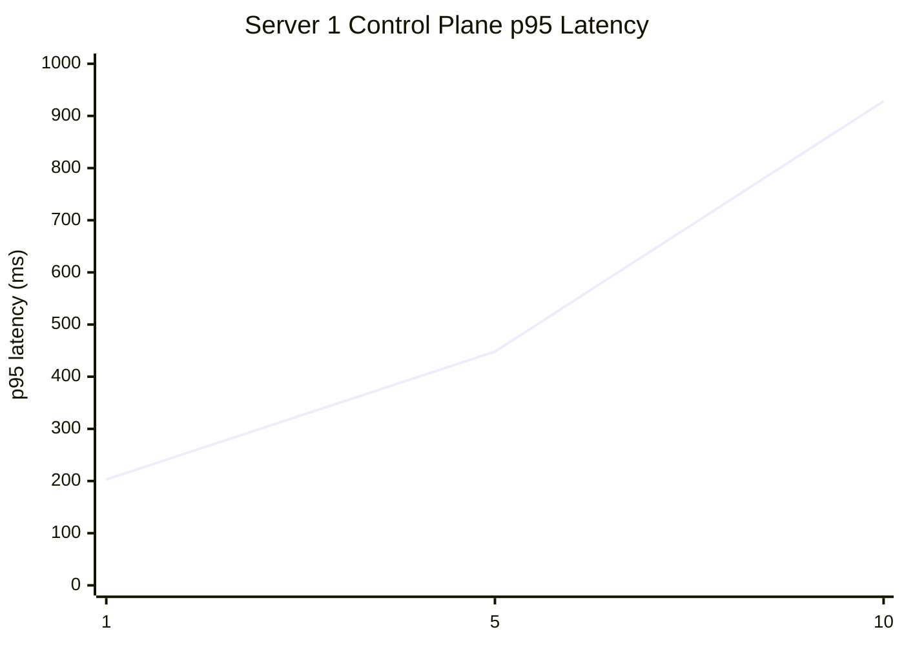
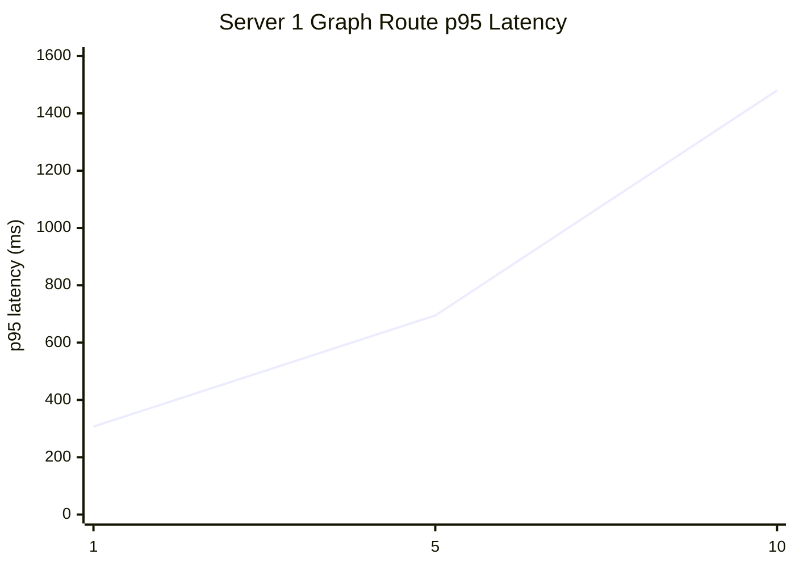
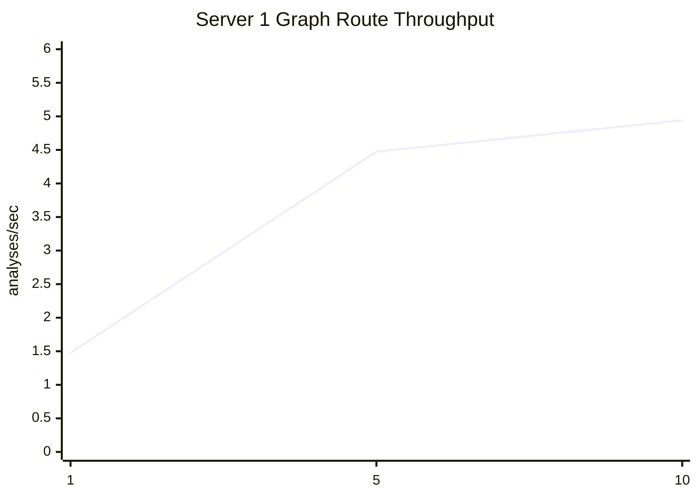
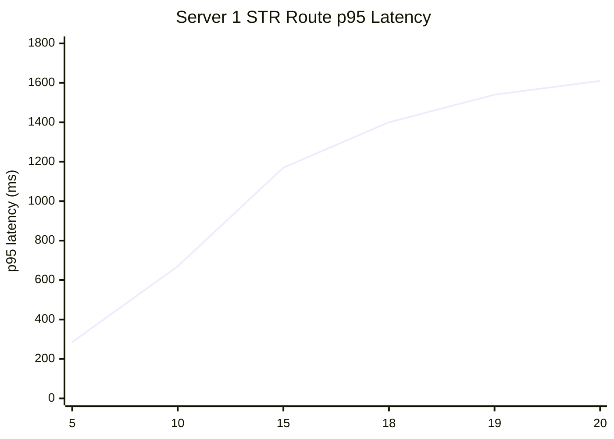

# Server 1 Stress Test Visuals

These charts summarize the latest Server 1 rechecks used for the backend ISO assessment.
They are point-in-time benchmark snapshots, not live exports from a monitoring system.
Older extended concurrency ladders remain documented in the broader handoff materials.

## Control Plane

Script: `tests/stress/k6/server1_session_control_plane.js`

| VUs | avg latency | p95 latency | iteration p95 |
|---|---:|---:|---:|
| 1 | 135.95 ms | 202.93 ms | 797.19 ms |
| 5 | 271.91 ms | 448.07 ms | 1.46 s |
| 10 | 583.87 ms | 928.24 ms | 2.76 s |

## Graph Routes

Script: `tests/stress/k6/server1_graph_routes.js`

| VUs | avg latency | p95 latency | iteration p95 |
|---|---:|---:|---:|
| 1 | 209.54 ms | 306.97 ms | 820.75 ms |
| 5 | 442.91 ms | 694.67 ms | 1.48 s |
| 10 | 995.13 ms | 1.48 s | 2.95 s |

## Graph Throughput

Graph-route throughput derived from the same rechecks:

| VUs | analyses/sec |
|---|---:|
| 1 | 1.47724 |
| 5 | 4.473422 |
| 10 | 4.94063 |

## STR Search / Dataframe

Script: `tests/stress/k6/server1_str_analysis.js`

Important note: the STR linking logic is not available in the deployed environment right now,
so these failures are expected for this benchmark snapshot and should not be read as a server-wide outage.

| VUs | p95 latency | Failure rate |
|---|---:|---:|
| 5 | 285.19 ms | 99.70% |
| 10 | 669.98 ms | 99.72% |
| 15 | 1.17 s | 99.72% |
| 18 | 1.40 s | 99.72% |
| 19 | 1.54 s | 99.72% |
| 20 | 1.61 s | 99.72% |

## Short Read

- Control-plane traffic stays within the `300 ms` average target at `1 VU` and `5 VUs`, but not at `10 VUs`.
- Graph routes exceed the `300 ms` average target from `5 VUs` upward.
- End-to-end graph-route time remains below `2 sec` through `5 VUs` and rises above that target at `10 VUs`.
- Graph-route throughput improved with concurrency, but remained far below the `5,000 analyses/sec` target.
- STR is currently not a valid capacity benchmark because the linking path is not available in the deployed environment.
