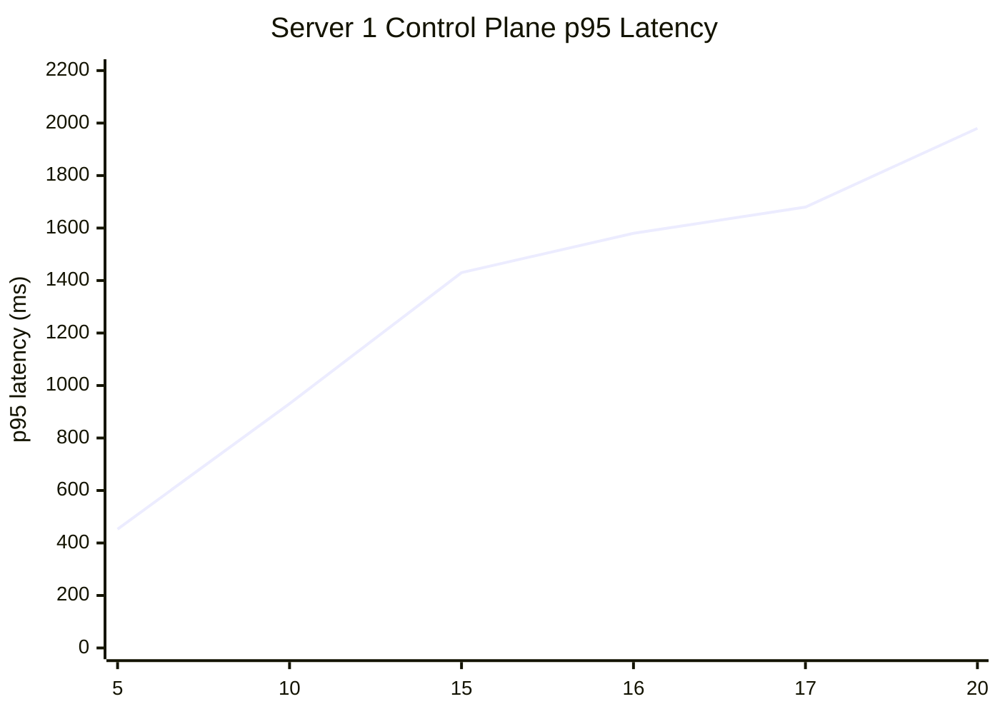
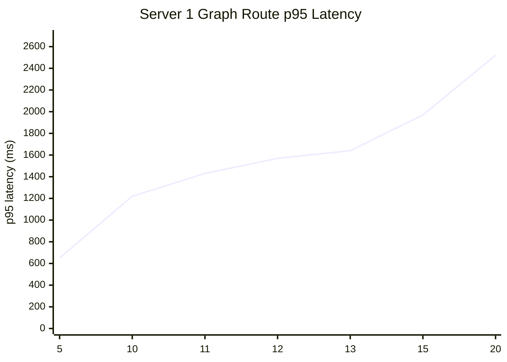
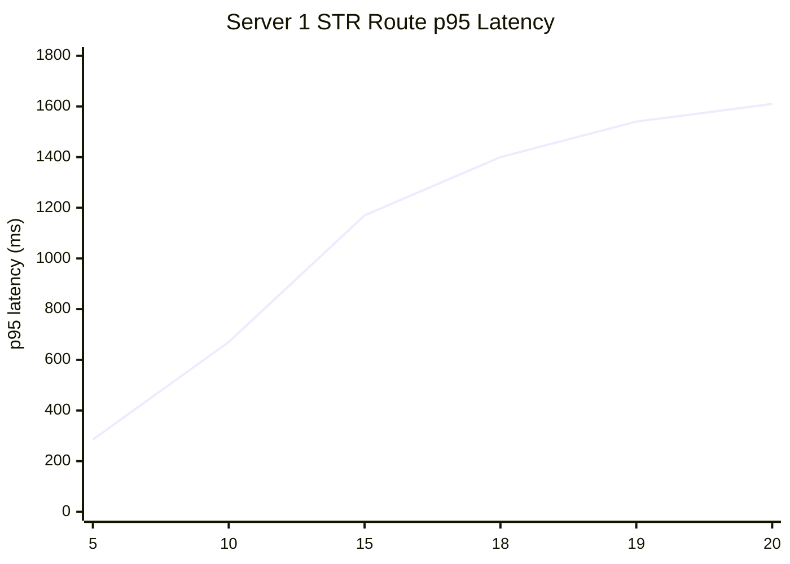

# Server 1 Stress Test Visuals

These charts are based on the recorded k6 results already captured for Server 1 in chat.
They are not live exports from a time-series backend, so they should be treated as a
clear visual summary of the current benchmark snapshot.

## Control Plane

Script: `tests/stress/k6/server1_session_control_plane.js`

| VUs | p95 latency |
|---|---:|
| 5 | 452.43 ms |
| 10 | 931.03 ms |
| 15 | 1.43 s |
| 16 | 1.58 s |
| 17 | 1.68 s |
| 20 | 1.98 s |

## Graph Routes

Script: `tests/stress/k6/server1_graph_routes.js`

| VUs | p95 latency |
|---|---:|
| 5 | 650.11 ms |
| 10 | 1.22 s |
| 11 | 1.43 s |
| 12 | 1.57 s |
| 13 | 1.64 s |
| 15 | 1.97 s |
| 20 | 2.52 s |

## STR Search / Dataframe

Script: `tests/stress/k6/server1_str_analysis.js`

Important note: the STR linking logic is not available in the deployed environment right now,
so these failures are expected for this benchmark snapshot and should not be read as a server-wide outage.

| VUs | p95 latency | Failure rate |
|---|---:|---:|
| 5 | 285.19 ms | 99.70% |
| 10 | 669.98 ms | 99.72% |
| 15 | 1.17 s | 99.72% |
| 18 | 1.40 s | 99.72% |
| 19 | 1.54 s | 99.72% |
| 20 | 1.61 s | 99.72% |

## Short Read

- Control-plane traffic stays healthy longer than graph traffic.
- Graph routes become noticeably slower earlier, around 11-12 VUs.
- STR is currently not a valid capacity benchmark because the linking path is not available.
- The most useful live capacity signals for Server 1 are the control-plane and graph-route charts.
