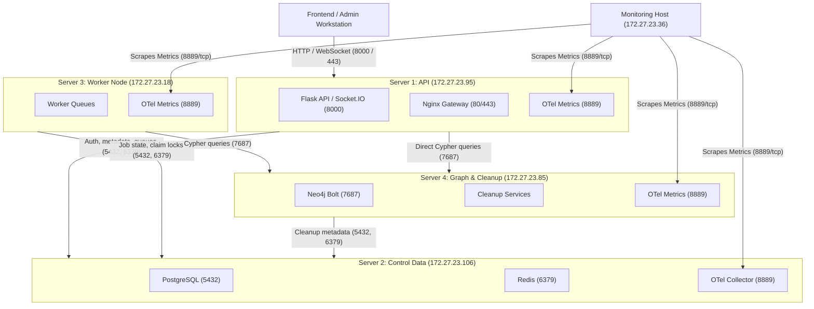

# LinkX Server Communication & Update Protocol Handoff

**Last Updated**: 2026-08-03  
**Target Audience**: AI Coding Agents & Operators  
**Purpose**: Document the 4-server network communication topology, OpenTelemetry observability setup, and standardized command delivery protocol to eliminate permission, subshell, and deployment errors.

---

## 1. Server Infrastructure & Network Topology

The LinkX backend split consists of 4 physical/virtual servers connected over a private network (`172.27.23.0/24`):

| Server | Hostname | IP Address | Main Role | Deployed Path | Systemd / Docker Unit |
| :--- | :--- | :--- | :--- | :--- | :--- |
| **Server 1** | `node-19` | `172.27.23.95` | **Flask API & Gateway** | `/opt/linkx-backend-api` | `linkx-api.service`, `nginx` |
| **Server 2** | `node-20` | `172.27.23.106` | **Control Data** | `/opt/linkx-control-data` | `linkx-postgres`, `linkx-redis`, `linkx-otel-collector` |
| **Server 3** | `node-21` | `172.27.23.18` | **Worker Node** | `/opt/linkx-worker` | `linkx-worker.service` |
| **Server 4** | `node-22` | `172.27.23.85` | **Graph & Maintenance** | `/opt/linkx-graph-maintenance`, `/opt/linkx-neo4j` | `linkx-cleanup-worker`, `linkx-cleanup-scheduler`, `linkx-neo4j` |
| **Monitoring Host** | — | `172.27.23.36` | **Prometheus / OTel Scraper** | — | Metrics Scraper |
| **Hadoop/Search Host**| — | `172.27.23.43` | **HDFS / Elastic Search** | — | WebHDFS `9870`, RPC `9000`, Data API `5000` |

---

## 2. Server Communication Matrix & Open Ports



### Complete Port Rules & UFW Firewall Table

| Source | Destination | Target Port | Protocol | Purpose / Description | UFW Constraint |
| :--- | :--- | :---: | :---: | :--- | :--- |
| Browser / Frontend | Server 1 | `8000` / `443` | TCP | REST API & Socket.IO requests | Open to frontend origin |
| Server 1, 3, 4 | Server 2 | `5432` | TCP | PostgreSQL DB connections | UFW restricted to S1, S3, S4 |
| Server 1, 3, 4 | Server 2 | `6379` | TCP | Redis cache & queue channels | UFW restricted to S1, S3, S4 (Auth required) |
| Server 1, 3 | Server 4 | `7687` | TCP | Neo4j Bolt graph queries | UFW restricted to S1, S3 |
| Admin Workstation | Server 4 | `7474` | TCP | Neo4j Browser admin console | Restricted to Admin IP `172.20.107.14` |
| **Monitoring (`172.27.23.36`)** | **Servers 1, 2, 3, 4** | **`8889`** | **TCP** | **OpenTelemetry Prometheus Metrics** | **UFW restricted strictly to `172.27.23.36`** |

---

## 3. Agent Protocol for Server Command Generation

When instructing the user to pull code updates and restart services on remote servers, AI agents **MUST** follow these 5 mandatory execution rules to prevent execution failures:

### Golden Rules for Command Delivery

> [!CAUTION]
> 1. **NEVER use `cd /opt/linkx-backend-update` in standard user shell**:
>    `/opt/linkx-backend-update` is owned by `root:root` with restricted permissions. Standard user `uadmin` will get `Permission denied`. Always use `sudo git -C /opt/linkx-backend-update pull`.
>
> 2. **NEVER use `sudo -i` or interactive subshell blocks in multi-line copy-pastes**:
>    Pasting `sudo -i` followed by `cd` and `git pull` fails because `sudo -i` launches a subshell and drops the remaining pasted lines. Provide self-contained commands with absolute paths using `sudo`.
>
> 3. **NEVER use `cp -r .../src/*` (wildcard globbing)**:
>    In non-interactive bash, `src/*` can fail with `No such file or directory` if glob expansion fails. Always use trailing dot notation: `sudo cp -r /path/to/src/. /target/path/src/`.
>
> 4. **ALWAYS install Pip dependencies BEFORE restarting systemd services**:
>    If `systemctl restart` is run before `pip install`, Python services will crash on startup due to missing module imports (`ModuleNotFoundError`).
>
> 5. **ALWAYS include a `sleep 3` or `sleep 4` boot delay before running verification**:
>    Services like Flask/eventlet require 2–4 seconds to initialize database connection pools and bind sockets. Running `verify-linkx-server.py` immediately after `systemctl restart` will cause false `Connection refused` (502) errors.

---

## 4. Standard Server Update Templates

Agents must provide updates formatted according to the following template:

### Server 1 (`node-19` - API Host)
```bash
sudo git -C /opt/linkx-backend-update pull
sudo /opt/linkx-backend-api/.venv/bin/python -m pip install 'prometheus-client>=0.22.1'
sudo cp -r /opt/linkx-backend-update/service_factory/services/linkx-api/src/. /opt/linkx-backend-api/src/
sudo systemctl restart linkx-api
sleep 4
sudo python3 /opt/linkx-backend-update/service_factory/deploy/security/verify-linkx-server.py --role api
```

### Server 2 (`node-20` - Control Data Host)
```bash
sudo git -C /opt/linkx-backend-update pull
sudo cp -r /opt/linkx-backend-update/service_factory/services/linkx-control-data/. /opt/linkx-control-data/
sudo docker compose -f /opt/linkx-control-data/docker-compose.yml up -d
sudo python3 /opt/linkx-backend-update/service_factory/deploy/security/verify-linkx-server.py --role control-data
```

### Server 3 (`node-21` - Worker Host)
```bash
sudo git -C /opt/linkx-backend-update pull
sudo /opt/linkx-worker/.venv/bin/python -m pip install 'prometheus-client>=0.22.1'
sudo cp -r /opt/linkx-backend-update/service_factory/services/linkx-worker/src/. /opt/linkx-worker/src/
sudo systemctl restart linkx-worker
sleep 3
sudo python3 /opt/linkx-backend-update/service_factory/deploy/security/verify-linkx-server.py --role worker
```

### Server 4 (`node-22` - Graph/Cleanup Host)
```bash
sudo git -C /opt/linkx-backend-update pull
sudo /opt/linkx-graph-maintenance/.venv/bin/python -m pip install 'prometheus-client>=0.22.1'
sudo cp -r /opt/linkx-backend-update/service_factory/services/linkx-graph-maintenance/src/. /opt/linkx-graph-maintenance/src/
sudo systemctl restart linkx-cleanup-worker linkx-cleanup-scheduler
sleep 3
sudo python3 /opt/linkx-backend-update/service_factory/deploy/security/verify-linkx-server.py --role graph-maintenance
```

---

## 5. Summary of Verification Expectations

All verification runs using `verify-linkx-server.py` across all four servers must return:
```text
PASS: OpenTelemetry metrics port 8889 is active and listening locally
summary: failures=0 warnings=0
```
