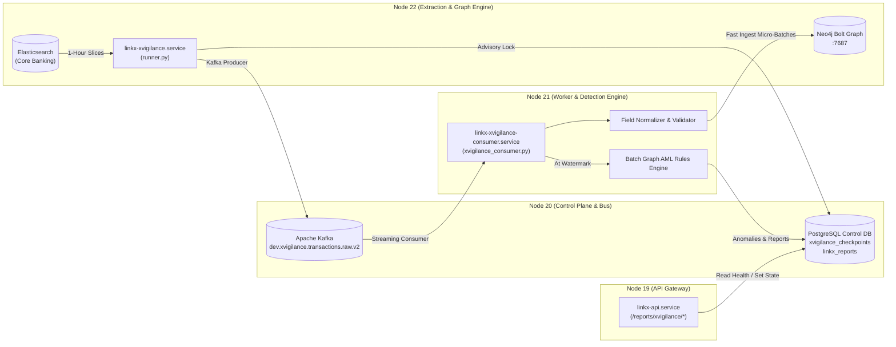

# National-Scale Production Architecture: xVigilance Autonomous Detective Pipeline

## 1. System Mission & Scope

The **xVigilance** autonomous detective engine is engineered for national-scale financial monitoring (specifically designed for the National Bank of Ethiopia). It processes continuous streams of banking transactions, constructs real-time temporal relationship graphs, detects complex anti-money laundering (AML) typologies (circular transfers, mule accounts, smurfing rings), and autonomously alerts compliance analysts.

---

## 2. Multi-Server Distributed Topology

The production architecture physically separates extraction, messaging, consumption, and computation across four dedicated nodes:



| Server | IP | Primary Responsibilities |
| :--- | :--- | :--- |
| **Node 19** | `172.27.23.95` | **Flask API Gateway (`linkx-api.service`)**: Exposes health monitoring, pause/resume state management, and clock rewind endpoints to the Admin UI. |
| **Node 20** | `172.27.23.106` | **Control Plane & Message Bus**: Hosts PostgreSQL (audit ledger, checkpoints, evidence tables) and Apache Kafka (port `9092`). |
| **Node 21** | `172.27.23.18` | **Worker Consumer (`linkx-xvigilance-consumer.service`)**: Streams records from Kafka, normalizes banking fields, fast-ingests micro-batches into Neo4j, and executes AML graph algorithms upon receiving watermarks. |
| **Node 22** | `172.27.23.85` | **Extraction & Graph Host**: Runs `linkx-xvigilance.service` (extracts sliding hour windows from Elasticsearch) and hosts the Neo4j Graph Database (Bolt port `7687`). |

---

## 3. Node-22 Enterprise Sizing & Memory Architecture

Node-22 hosts both the **Neo4j Enterprise Graph Engine** and the **xVigilance Extraction Daemon**. Because it handles millions of transactions, its memory configuration has been tuned for strict high-availability:

### Neo4j Enterprise Tuning (`/opt/linkx-neo4j/docker-compose.yml`)
* **Physical Server RAM:** 11.68 GB.
* **JVM Heap Allocation:** `4G` initial / `4G` max (`-Xms4G -Xmx4G`). Sized to handle heavy GDS/Cypher algorithmic traversals (PageRank, Weakly Connected Components, cycle detection) on millions of nodes.
* **PageCache Allocation:** `3G` (`NEO4J_server_memory_pagecache_size: 3G`). Optimized from legacy 6G. In Neo4j binary storage, 3 GB caches up to **6 million transactions** 100% in RAM without disk paging, while returning **3+ GB of physical RAM to the host OS**.
* **Installed Enterprise Plugins:** `graph-data-science` (GDS) and `apoc`.

### Operating System Memory Safety (Emergency Swap Buffer)
* **Dedicated Swap File:** 4.0 GB (`/swapfile`, `chmod 600`, active in `/etc/fstab`).
* **Swappiness Setting:** `vm.swappiness = 10` (configured in `/etc/sysctl.conf`).
* **Operational Impact:** The Linux kernel runs all active computations inside physical RAM. If an unexpected multi-million transaction surge occurs, Swap acts as an emergency shock-absorber, completely preventing the Linux kernel **Out-Of-Memory (OOM) Killer** from terminating Neo4j.
* **Available Headroom:** Node-22 maintains **~10 GB of available memory**, eliminating memory exhaustion risks.

---

## 4. High-Concurrency Mutual Exclusion (Dual-Layer Mutex)

To prevent duplicate processes from racing against the same historical window (which could flood Kafka with duplicate transactions), `runner.py` enforces a **Dual-Layer Enterprise Mutex**:

1. **Host-Level OS Kernel Lock:** Acquired via non-blocking `fcntl.flock(LOCK_EX | LOCK_NB)` on `/tmp/linkx_xvigilance_runner.lock`. If another process is running on Node-22, the second process exits in `<2ms`.
2. **Cluster-Wide PostgreSQL Advisory Lock:** Acquired via `SELECT pg_try_advisory_lock(97130282477900)` on the shared database on Node-20. This prevents multiple nodes or containers from ever executing concurrent extractions on the same feed.

---

## 5. End-to-End Processing Lifecycle

### Phase 1: High-Speed Window Extraction (Node-22)
1. Reads `xvigilance_checkpoints.last_window_end` from PostgreSQL.
2. If the current time is ahead of `last_window_end`, it processes the 1-hour window `[window_start -> window_end]`.
3. Streams records from Elasticsearch in 50,000-row pages.
4. Pushes transactions to Kafka topic `dev.xvigilance.transactions.raw.v2` stamped with headers:
   * `source = "xvigilance-daemon"`
   * `session_id = "XVIGILANCE_FINDINGS"`
   * `window_id = window_start.isoformat()`
5. Upon reaching the end of the hour window, it emits a `WINDOW_COMPLETE` **Watermark** containing metadata (`total_records`, `batch_id`, `window_id`) and flushes the Kafka producer.
6. Advances `xvigilance_checkpoints.last_window_end` and logs the completed run to `xvigilance_slice_runs`.

### Phase 2: Fast-Ingestion Micro-Batching (Node-21)
1. The consumer listens to `dev.xvigilance.transactions.raw.v2` as group `xvigilance-graph-consumer-v2`.
2. **Micro-Batch Buffering:** Buffers incoming Kafka messages into 10,000-row micro-batches.
3. **Data Normalization:** Validates required AML attributes (`ACCOUNTNO`, `BENACCOUNTNO`, `AMOUNT`, `TRANSACTIONDATE`, `TRANSACTIONTIME`).
4. **Optimized Neo4j Ingestion:** Uses parameterized Cypher with `UNWIND` to insert relationships and account nodes in high-speed batches (~6.5 seconds per 10k batch, ~1,500 tx/sec).
5. All ephemeral nodes are tagged with `:bank_transactions_xvigilance-daemon` to ensure 100% isolation from manual user investigations.

### Phase 3: Batch Graph Analytics at Watermark (Node-21)
1. Ingestion continues at top speed until the consumer encounters the `WINDOW_COMPLETE` Watermark event.
2. Ingestion pauses, and the worker executes the batch AML graph algorithms against the assembled 1-hour graph in Neo4j:
   * **Circular Transaction Loops:** Multi-hop cycles where funds return to origin accounts.
   * **Fan-In / Fan-Out (Smurfing):** High-frequency rapid dispersal or consolidation.
   * **Mule Account Rings & Hub-and-Spoke Networks:** Accounts with high counterparty degrees or rapid fund distributions.
3. Detected anomalies are:
   * **Full Connected Component Evidence Expansion:** Instead of only extracting transactions from the active slice boundary, the detective expands evidence along the flagged anomaly relationships to capture all connected transaction nodes (e.g. all counterparties in Hub & Spoke), capped strictly at **1,000 nodes/edges** to prevent memory exhaustion on runaway thresholds.
   * Exported to PostgreSQL `linkx_reports` with dynamic fraud scores and score bands.
   * Saved into `link_analysis_evidence` with full metadata (`evidence_limit: 1000`, `evidence_truncated: boolean`, `total_nodes`, `total_edges`).
   * Dispatched asynchronously to the external Risk Scoring service API (`/api/risk_scoring/analysis_request`).

### Phase 4: Ephemeral Graph Purge & Clean Slate
1. Once batch analysis completes, the consumer executes:
   ```cypher
   MATCH (n:bank_transactions_xvigilance-daemon)
   DETACH DELETE n
   ```
2. This clears Neo4j memory completely, preventing graph bloat or OOM crashes while processing billions of historical records.
3. Permanent investigative evidence is safely retained in PostgreSQL.

---

## 6. Administrative Controls: Pause & Clock Rewind

### Operational Pause (Graceful Quiescence)
- **Consumer (Node-21):** Pauses between 10k-record micro-batches (<6 seconds response). Unconsumed messages wait safely in Kafka.
- **Runner (Node-22):** Completes the currently in-flight 1-hour window to preserve ledger atomicity, emits the Watermark, and halts before opening the next window. Resuming picks up cleanly with **zero duplicate messages** and **zero dropped transactions**.

### Clock Rewind (Scenario B: 1-Click Fresh Reset)
- Endpoint: `POST /api/v1/reports/xvigilance/rewind`.
- Updates `last_window_end` to the target historical timestamp.
- Purges any in-flight ephemeral nodes in Neo4j.
- Resets Kafka consumer offsets to `latest` to clear obsolete buffer data.
- Both Runner and Consumer detect the timestamp rollback automatically in memory without service restarts.
